# LDIR CI/CD Pipeline Configuration

**Version:** 1.0.0
**Status:** DRAFT
**Date:** 2026-04-23
**References:** SEC-STP-001 (Security Test Plan), BM-XXX (Benchmark Suite), REQ-9.1 (Continuous Fuzzing)
**Platforms:** GitHub Actions (primary), self-hosted runners (nightly fuzzing)

---

## 1. Pipeline Overview

```mermaid
graph LR
    LINT[Stage 1: Lint] --> BUILD[Stage 2: Build]
    BUILD --> TEST[Stage 3: Test]
    TEST --> LEAN[Stage 4: Lean4 Verify]
    LEAN --> SEC[Stage 5: Security]
    SEC --> FUZZ[Stage 6: Fuzz]
    FUZZ --> BENCH[Stage 7: Benchmark]
    BENCH --> COV[Stage 8: Coverage]
    COV --> SBOM[Stage 9: SBOM]
    SBOM --> REL[Stage 10: Release]
```



### 1.1 Trigger Rules

| Event | Branches | Stages |
|-------|----------|--------|
| Push to `main` | `main` | 1–9 |
| Pull request | any → `main` | 1–8 |
| Push tag `v*` | — | 1–10 (full) |
| Schedule (nightly) | `main` | 1–9 + extended fuzzing |
| Manual dispatch | any | Selectable |

---

## 2. Stage Definitions

### Stage 1: Lint

**Jobs:** `lint-rust`, `lint-lean`

| Job | Command | Timeout | Failure Action |
|-----|---------|---------|----------------|
| `lint-rust` | `cargo fmt --check --all` | 2 min | Block merge |
| `lint-rust` | `cargo clippy --all-targets --all-features -- -D warnings` | 10 min | Block merge |
| `lint-lean` | `lake lint` | 5 min | Block merge |

**Gate:** Zero clippy warnings, zero formatting diffs.

---

### Stage 2: Build

**Jobs:** `build-native`, `build-wasm`, `build-c-abi`

| Job | Command | Target | Timeout |
|-----|---------|--------|---------|
| `build-native` | `cargo build --release --all-targets` | x86-64-unknown-linux-gnu | 15 min |
| `build-native` | `cargo build --release --target aarch64-unknown-linux-gnu` | aarch64-unknown-linux-gnu | 15 min |
| `build-wasm` | `cargo build --release --target wasm32-unknown-unknown -p ldir-wasm` | wasm32-unknown-unknown | 10 min |
| `build-c-abi` | `cargo build --release --features c-abi` | x86-64-unknown-linux-gnu | 10 min |

**Gate:** All targets compile with zero errors and zero warnings.

---

### Stage 3: Test

**Jobs:** `test-unit`, `test-integration`, `test-doc`

| Job | Command | Timeout | Parallel |
|-----|---------|---------|----------|
| `test-unit` | `cargo test --all --lib` | 15 min | 4 jobs (split by crate) |
| `test-integration` | `cargo test --all --test '*'` | 20 min | 4 jobs |
| `test-doc` | `cargo test --all --doc` | 10 min | 2 jobs |

**Test matrix:**

| Crate | Unit | Integration | Doc |
|-------|------|-------------|-----|
| ldir-ir | Yes | — | Yes |
| ldir-core | Yes | Yes | Yes |
| ldir-tex | Yes | Yes | Yes |
| ldir-md | Yes | Yes | Yes |
| ldir-pdf | Yes | Yes | Yes |
| ldc | — | Yes | Yes |

**Gate:** All tests pass (exit code 0).

---

### Stage 4: Lean4 Verify

**Jobs:** `lean-build`, `lean-test`

| Job | Command | Timeout |
|-----|---------|---------|
| `lean-build` | `cd ldir-lean && lake build` | 30 min |
| `lean-test` | `cd ldir-lean && lake test` | 15 min |

**Gate:** 0 Lean errors, 0 `sorry` in non-admitted proofs (FV-001..009 from BP-IR-COMPILER-001).

---

### Stage 5: Security

**Jobs:** `audit`, `dependency-check`

| Job | Command | Timeout | Severity Threshold |
|-----|---------|---------|-------------------|
| `audit` | `cargo audit --deny unmaintained --deny unsound --deny yanked` | 5 min | Any advisory blocks merge |
| `audit` | `cargo audit --deny warnings --deny RUSTSEC-2024-*` | 5 min | CVE-based |
| `dependency-check` | `cargo deny check licenses bans sources` | 5 min | Per `deny.toml` config |

**Gate:** Zero critical CVEs (QG-004), zero unmaintained dependencies.

---

### Stage 6: Fuzz

**Jobs:** `fuzz-sir`, `fuzz-font`, `fuzz-constraint`, `fuzz-fixedpoint`, `fuzz-linebreak`

| Job | Target | Duration (CI) | Duration (Nightly) | Tool |
|-----|--------|---------------|--------------------|------|
| `fuzz-sir` | FT-001 | 5 min | 8 h | cargo-fuzz + ASan |
| `fuzz-font` | FT-002 | 5 min | 8 h | cargo-fuzz + AFL++ |
| `fuzz-constraint` | FT-003 | 5 min | 4 h | cargo-fuzz |
| `fuzz-fixedpoint` | FT-004 | 3 min | 2 h | cargo-fuzz + UBSan |
| `fuzz-linebreak` | FT-005 | 5 min | 4 h | cargo-fuzz |

**CI corpus management:**

- Seed corpus stored in `ci/fuzz-corpus/<target>/`
- CI artifacts upload new crashes as `fuzz-crash-<target>-<sha>.bin`
- Nightly runs merge new inputs into seed corpus
- Crash deduplication via `sha256sum` on crash inputs

**Gate:** No new crashes discovered in CI run.

---

### Stage 7: Benchmark

**Jobs:** `benchmark-regression`, `benchmark-baseline`

| Job | Command | Timeout | Threshold |
|-----|---------|---------|-----------|
| `benchmark-regression` | `cargo criterion --compare main` | 30 min | > 5% regression fails |
| `benchmark-baseline` | `cargo criterion --baselines save` | 30 min | On `main` merge only |

**Benchmarks executed:** BM-PARSE-001, BM-COMPILE-001, BM-FIXPT-001, BM-LAYOUT-001, BM-PAGINATE-001, BM-ECS-001, BM-CONCURRENCY-001

**Gate:** No individual benchmark regresses > 5% vs `main` baseline (QG-006).

---

### Stage 8: Coverage

**Jobs:** `coverage-report`

| Job | Command | Timeout | Output |
|-----|---------|---------|--------|
| `coverage-report` | `cargo tarpaulin --out Xml --out Html --branch --workspace` | 30 min | `coverage/` artifact |

**Coverage thresholds:**

| Path | Threshold | Rationale |
|------|-----------|-----------|
| `ldir-core/src/fp26_6.rs` | >= 95% | Critical arithmetic (STP-004) |
| `ldir-core/src/validator.rs` | >= 95% | Security boundary (STP-003) |
| `ldir-core/src/compiler.rs` | >= 95% | Core transform (THM-COMPILE-WF-001) |
| `ldir-core/src/parser.rs` | >= 95% | Untrusted input (STP-003.1) |
| Overall workspace | >= 80% | QG-005 |

**Gate:** All thresholds met.

---

### Stage 9: SBOM

**Jobs:** `generate-sbom`

| Job | Command | Timeout | Format |
|-----|---------|---------|--------|
| `generate-sbom` | `cargo sbom --output sbom.spdx.json` | 5 min | SPDX 2.3 JSON |

**Gate:** SBOM generated and uploaded as CI artifact.

---

### Stage 10: Release

**Jobs:** `publish-crate`, `github-release`

**Trigger:** Git tag matching `v[0-9]+.[0-9]+.[0-9]+`

| Job | Command | Conditions |
|-----|---------|------------|
| `publish-crate` | `cargo publish --token $CRATES_IO_TOKEN` | Tag on `main`, all gates pass |
| `github-release` | `gh release create $TAG --notes-from-tag` | Tag on `main` |

**Changelog generation:**

```bash
conventional-changelog -p angular -i CHANGELOG.md -s
git add CHANGELOG.md
git commit -m "chore: update changelog for $TAG"
```

**SemVer policy:**

| Change Type | Version Bump | Example Commit |
|-------------|-------------|----------------|
| Breaking API change | MAJOR | `feat!: change compile_sir signature` |
| New feature (backward-compatible) | MINOR | `feat: add CJK line breaking` |
| Bug fix, perf improvement | PATCH | `fix: fp26_6 overflow on boundary` |

---

## 3. Quality Gates

| ID | Gate | Threshold | Enforced At | Block Merge |
|----|------|-----------|-------------|-------------|
| QG-001 | All tests pass | exit code 0 | Stage 3 | Yes |
| QG-002 | Zero clippy warnings | 0 warnings | Stage 1 | Yes |
| QG-003 | Lean4 proofs compile | 0 errors | Stage 4 | Yes |
| QG-004 | No critical CVEs | 0 RUSTSEC critical/high | Stage 5 | Yes |
| QG-005 | Branch coverage | >= 80% overall, >= 95% critical | Stage 8 | Warning only (not block) |
| QG-006 | No performance regression | <= 5% per benchmark | Stage 7 | Warning only (not block) |
| QG-007 | No fuzz crashes | 0 new crashes | Stage 6 | Yes |
| QG-008 | All targets build | 0 errors | Stage 2 | Yes |

---

## 4. Rollback Strategy

### 4.1 Phase Checkpoint Tags

| Tag Pattern | Example | Trigger |
|-------------|---------|---------|
| `phase-0-complete` | `phase-0-complete` | Requirements approved |
| `phase-1-complete` | `phase-1-complete` | Research complete |
| `phase-2-complete` | `phase-2-complete` | Architecture approved |
| `phase-3-complete` | `phase-3-complete` | Security plan approved |
| `phase-4-complete` | `phase-4-complete` | Performance baselines set |
| `phase-5-complete` | `phase-5-complete` | Adversarial tests pass |
| `phase-6-complete` | `phase-6-complete` | CI/CD operational |

### 4.2 Automated Rollback

| Trigger | Action |
|---------|--------|
| QG-001 failure | Block PR merge; notify author |
| QG-002 failure | Block PR merge; suggest `cargo clippy --fix` |
| QG-004 failure | Block PR merge; create security issue |
| QG-007 failure | Block PR merge; attach crash artifact |
| QG-006 regression > 5% | Comment on PR; do not block merge |
| QG-005 below threshold | Comment on PR; do not block merge |

### 4.3 Manual Rollback

| Error Level | Response | Approval Required |
|-------------|----------|-------------------|
| Level 1–3 | Automated (see above) | None |
| Level 4 | Revert commit via `git revert` | Maintainer |
| Level 5 | Branch protection override | 2 maintainers + security review |

---

## 5. Environment Configuration

### 5.1 Runner Specs

| Runner | OS | CPU | RAM | Purpose |
|--------|----|-----|-----|---------|
| `ubuntu-latest` | Ubuntu 24.04 | 4-core | 16 GB | Stages 1–5, 8–9 |
| `self-hosted-fuzz` | Ubuntu 24.04 | 16-core | 64 GB | Stage 6 (nightly) |
| `self-hosted-bench` | Ubuntu 24.04 | 16-core | 64 GB | Stage 7 (isolation) |
| `macos-latest` | macOS 14 | 4-core | 16 GB | Cross-platform validation (weekly) |

### 5.2 Caching Strategy

| Cache Key | Content | TTL |
|-----------|---------|-----|
| `cargo-registry-{{ hash('Cargo.lock') }}` | `~/.cargo/registry` | 7 days |
| `cargo-target-{{ hash('Cargo.lock') }}` | `target/` | 7 days |
| `lake-build-{{ hash('lake-manifest.json') }}` | `.lake/build/` | 7 days |
| `fuzz-corpus-{{ target }}` | `ci/fuzz-corpus/<target>/` | 30 days |

### 5.3 Secret Management

| Secret | Usage | Rotation |
|--------|-------|----------|
| `CRATES_IO_TOKEN` | `cargo publish` | 90 days |
| `GITHUB_TOKEN` | `gh release create` | Auto (GitHub) |
| `CODECOV_TOKEN` | Coverage upload | 365 days |

---

## 6. Pipeline Metrics

| Metric | Collection | Alert Threshold |
|--------|-----------|-----------------|
| Total pipeline duration | GitHub Actions timing | > 60 min (PR), > 120 min (nightly) |
| Stage failure rate | GitHub Actions API | > 10% failure rate (7-day rolling) |
| Flaky test detection | `cargo nextest` retry report | > 5% flake rate per test |
| Artifact storage | `gh api` artifact size | > 10 GB total |
| Fuzz corpus growth | Nightly corpus size delta | > 100 MB/day growth |

---

## 7. Summary

| Category | Count |
|----------|-------|
| Pipeline stages | 10 |
| Quality gates | 8 |
| Fuzzing targets in CI | 5 |
| Phase checkpoint tags | 7 |
| Runner types | 4 |

---

*End of pipeline_config.md v1.0.0*
